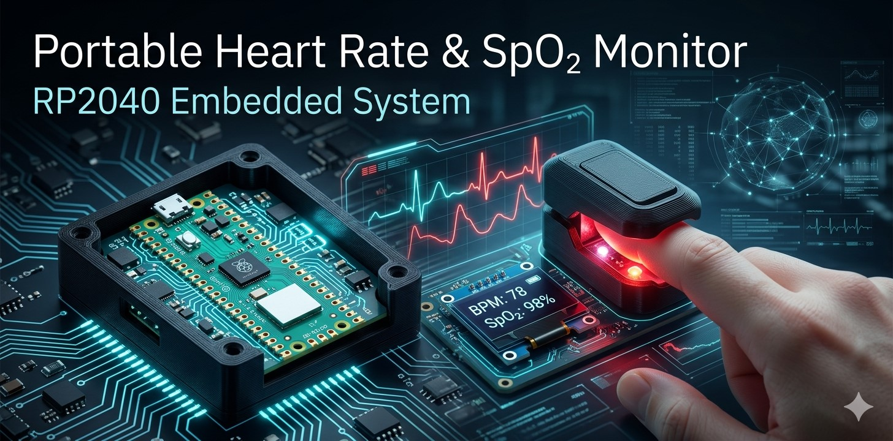

<p align="center">
  
</p>

## 📌 Descrição do Projeto

Este projeto consiste no desenvolvimento de um sistema embarcado portátil para monitoramento de sinais vitais, capaz de medir:

- Frequência cardíaca (BPM – Beats Per Minute)
- Saturação de oxigênio no sangue (SpO₂)

O sistema é baseado no microcontrolador **RP2040** e utiliza sensores ópticos para aquisição dos sinais biológicos através da técnica de **fotopletismografia (PPG)**, empregando LEDs nas faixas vermelha e infravermelha juntamente com um fotodetector.

O projeto foi desenvolvido para a disciplina de **Instrumentação e Microcontroladores e Sistemas Microcontrolados**, com foco na aplicação na área da saúde.

# 🎯 Objetivo

Desenvolver um sistema embarcado completo utilizando o microcontrolador RP2040, integrando:

- Construção e integração de sensor analógico;
- Condicionamento e tratamento de sinais biomédicos;
- Aquisição e processamento digital de sinais;
- Interface de visualização de dados;
- Acionamento de saídas/alertas;
- Desenvolvimento de PCB e estrutura mecânica.

O sistema busca fornecer medições básicas de sinais vitais de forma portátil, didática e de baixo custo.

# 🧠 Fundamentação Teórica

O projeto utiliza o princípio da **fotopletismografia (PPG)**, técnica óptica que detecta variações no volume sanguíneo através da absorção de luz pelos tecidos.

Dois comprimentos de onda são utilizados:

- 🔴 LED Vermelho (~660 nm)
- 🔴 LED Infravermelho (~940 nm)

A hemoglobina oxigenada e desoxigenada absorvem essas frequências de forma diferente, permitindo estimar a saturação de oxigênio no sangue (SpO₂).

Além disso, as oscilações periódicas do sinal PPG permitem calcular a frequência cardíaca do usuário.

# ⚙️ Funcionalidades

- Medição da frequência cardíaca (BPM)
- Estimativa da saturação de oxigênio (SpO₂)
- Filtragem analógica e digital do sinal
- Exibição dos dados em display OLED
- Comunicação serial via USB/UART
- Sistema de alertas sonoros
- Estrutura mecânica impressa em 3D
- PCB dedicada para integração do sistema

# 🧩 Arquitetura do Sistema

## Diagrama de Blocos

```text
          ┌─────────────────────┐
          │ LEDs Vermelho / IR │
          └──────────┬──────────┘
                     │
                     ▼
          ┌─────────────────────┐
          │    Dedo do Usuário  │
          └──────────┬──────────┘
                     │ Luz refletida/transmitida
                     ▼
          ┌─────────────────────┐
          │     Fotodiodo       │
          └──────────┬──────────┘
                     │
                     ▼
          ┌─────────────────────┐
          │ Condicionamento de │
          │       Sinais        │
          │ (Amplificação +     │
          │     Filtragem)      │
          └──────────┬──────────┘
                     │
                     ▼
          ┌─────────────────────┐
          │      RP2040         │
          │ Aquisição + DSP     │
          └───────┬─────┬───────┘
                  │     │
        ┌─────────┘     └─────────┐
        ▼                         ▼
┌──────────────┐         ┌────────────────┐
│ Display OLED │         │ Buzzer / Alerta│
└──────────────┘         └────────────────┘
```

# 🔌 Hardware Utilizado

## Microcontrolador

- RP2040 (Raspberry Pi Pico)

## Sensores

- LEDs Vermelho e Infravermelho
- Fotodiodo/Fototransistor

## Condicionamento de Sinal

- Amplificador operacional
- Filtros passa-baixa e passa-alta
- Ajuste de offset
- Proteção de entrada ADC

## Interface

- Display OLED I2C
- Comunicação Serial USB/UART
- Buzzer para alertas

## Estrutura Mecânica

- Case impresso em 3D
- Suporte para dedo/sensor

# 🖥️ Firmware

O firmware foi desenvolvido em:

- Linguagem C
- SDK oficial do RP2040
- Visual Studio Code

## Principais módulos

- Aquisição ADC
- Controle dos LEDs
- Filtragem digital
- Cálculo de BPM
- Estimativa de SpO₂
- Comunicação serial
- Interface gráfica

# 📂 Estrutura do Repositório

```text
├── firmware/
│   ├── src/
│   ├── include/
│   └── CMakeLists.txt
│
├── hardware/
│   ├── esquematico/
│   ├── pcb/
│   └── simulacoes/
│
├── mecanica/
│   ├── stl/
│   └── cad/
│
├── docs/
│   ├── relatorio/
│   ├── apresentacao/
│   └── imagens/
│
└── README.md
```

# 📊 Tratamento de Sinais

O sinal captado pelo fotodiodo apresenta baixa amplitude e elevada susceptibilidade a ruídos, exigindo técnicas de condicionamento e processamento.

Foram implementados:

- Amplificação analógica
- Filtragem passa-faixa
- Remoção de offset DC
- Média móvel
- Filtragem digital

O objetivo é melhorar a relação sinal-ruído e permitir medições mais confiáveis.

# 📸 Fotos do Projeto

## Protótipo

> Inserir imagem do protótipo aqui

```text
/docs/imagens/prototipo.jpg
```

# PCB

> Inserir imagem da PCB aqui

```text
/docs/imagens/pcb.jpg
```

# 🎥 Vídeo de Funcionamento

> Inserir link do vídeo demonstrativo

```text
youtube.com/(alguma coisa)
```

# 📄 Relatório Técnico

> O relatório técnico completo do projeto encontra-se em:

```text
/docs/apresentacao/
```

-=-=-=-=-=-=-=-=-=-=-=-=-=-=-=-=-=-=-=-=-=-=-=-=-=-=-=-=-=-=-=-=-=-=-=-=-=-=-=-=-=-=-=-=-=-=-=-=-=-=-=-=-=-=-=-=-=-=-=-=-=-=-=-=-=-=-=-=-=-=-=-=-=-=-=-=-=-=-=-=-=-=-=-=-=-=-=-=-=-=-=-=-=-=-=-=-=-=-=-=-=-=-=-=-=-=-=-=-=-=-=

# 👨‍💻 Integrantes

| Nome | RA |
|---|---|
| Nome Integrante 1: Erich Abreu Serfaim | R.A. 23.10022-2 |
| Nome Integrante 2: João Pedro de Jesus Cândido Silva | R.A. 23.01416-4 |

# 🏫 Instituição

**Instituto Mauá de Tecnologia (IMT)**

**Disciplina:** Instrumentação e Microcontroladores e Sistemas Microcontrolados

**Professores:**

- Prof. Andressa Martins  
- Prof. Rodrigo França

# 📅 Cronograma

| Etapa | Data |
|---|---|
| Apresentação do Projeto | 02/06/2026 |
| Entrega do Relatório | 28/06/2026 |

# 📜 Licença

Copyright (c) 2026 Instituto Mauá de Tecnologia (IMT)

Este projeto foi desenvolvido para fins acadêmicos na disciplina de Instrumentação e Microcontroladores e Sistemas Microcontrolados.

Licenciado sob a licença MIT.

Permission is hereby granted, free of charge, to any person obtaining a copy
of this software and associated documentation files (the "Software"), to deal
in the Software without restriction, including without limitation the rights
to use, copy, modify, merge, publish, distribute, sublicense, and/or sell
copies of the Software, and to permit persons to whom the Software is
furnished to do so, subject to the following conditions:

The above copyright notice and this permission notice shall be included in all
copies or substantial portions of the Software.

THE SOFTWARE IS PROVIDED "AS IS", WITHOUT WARRANTY OF ANY KIND, EXPRESS OR
IMPLIED, INCLUDING BUT NOT LIMITED TO THE WARRANTIES OF MERCHANTABILITY,
FITNESS FOR A PARTICULAR PURPOSE AND NONINFRINGEMENT. IN NO EVENT SHALL THE
AUTHORS OR COPYRIGHT HOLDERS BE LIABLE FOR ANY CLAIM, DAMAGES OR OTHER
LIABILITY, WHETHER IN AN ACTION OF CONTRACT, TORT OR OTHERWISE, ARISING FROM,
OUT OF OR IN CONNECTION WITH THE SOFTWARE OR THE USE OR OTHER DEALINGS IN THE
SOFTWARE.
